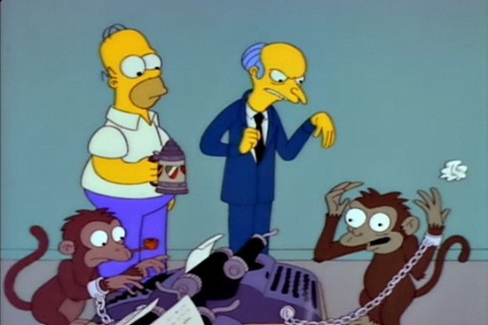
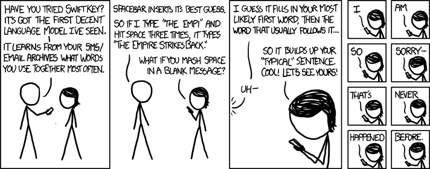

# Welcome

* How many of you made a bot before?
* How many of you follow bots on Twitter?

## Nice to meet you

* Who are you?
* Why are you here?


# Can computers make art?

Or more specifically...

> Can computer algorithms generate art?

Of course! We could argue that computers don't know (yet) they have generated something worthy of being considered art. 

<!-- Computer programs lack self-awareness (at present), and for the sake of this workshop, they lack what is called *curation coefficient*: they don't know if what they generated is good. --> 

The question is **not whether** or not art can be made using algorithms, **but how**.

### The Infinite Monkey theorem

> Given enough time, a hypothetical monkey typing at **random** would, as part of its output, almost surely produce all of Shakespeare’s plays.

[](https://www.youtube.com/watch?v=no_elVGGgW8)

Let's not try this with real monkeys! Instead we could (quite easily) create a computer program that simulates the theorem's hypothetical monkey. We could instruct our algorithmic monkey to *play dice* and combine sets of symbols to compose words, words to make sentences and so on.

### Since we don't have enough time...

What's the likelihood of getting a meaningful sentence out of a completely random combination of characters? It depends ... in any case it's *very* low.

How do we train our algorithmic monkey to hit meaningful sentences more often?

1. With probability, ie: a [**Markov chain**](https://en.wikipedia.org/wiki/Markov_chain). 

	There are two *states* in a Markov chain: what happens *now* and what can happen *next*. Each state has a probability associated with it. What happens next depends only on what happened now, not what happened two or three steps ago, even if there are multiple states. [Here's an interactive explanation](http://setosa.io/blog/2014/07/26/markov-chains/) of Markov chains. 
  
	Now back to the monkey.. we could feed it with **source material** (eg: an article, a poem, an entire book...) and teach it to notice which words are more likely to follow each word in the source text. Then we could ask the monkey to build chains of words: starting from one word (perhaps a random word, or one that is likely to appear at the beginning of sentences in the source text), then picking the *next* word at random from the ones that follow the current word in the source text. 

	Spam bots often use Markov chains to generate semi-sensical texts (see [Spam Poetry](http://www.spampoetry.org)). Other fascinating examples of Markov chains used on social media are [What would I say?](http://what-would-i-say.com) and the [Trump bot](https://filiph.github.io/markov/).
	
	
* Using a **generative grammar**, ie: a set of rules that can generate combinations of words which form grammatical sentences. 
	
	We are familiar with the idea of *grammar* as a set of rules that define how we combine words in the languages we use to speak every day, so that other humans can understand us. 
	
	
	
	A generative grammar is based on the role that each word plays in a sentence, not on probability. This results in sentences that are generally more meaningful than those generated with Markov chains. 
	
	People have used generative grammars to make things like the [Art Critique generator](http://www.pixmaven.com/phrase_generator.html), the [Artist Bio generator](http://500letters.org/form_15.php), the [Fifty Shades generator](http://www.fiftyshadesgenerator.com/) and many other *generators*.
	
	A generative grammar is made of a set of **structural rules**, which tell the computer how to put things together, and a set of **expansions**, which are options the computer can pick when generating stuff. 
	
<!-- Why grammars instead of Markov chains? Because they tend to be easier to start with, and give you more control over the generated output -->
	
# Let's play a generative grammar

To understand how a generative grammar works (and that it doesn't only apply to text) we'll use one to make drawings, together!

This activity is inspired by the work of conceptual artist [Sol LeWitt](https://www.moma.org/learn/moma_learning/themes/conceptual-art/sol-lewitt-and-instruction-based-art) and design collective [Conditional Design](https://www.conditionaldesign.org/).

> Pick a *random* marker, place your hand on a *random* point on the paper, draw a line to another *random* point.


Today we're using [Tracery](http://www.crystalcodepalace.com/tracery.html), a language specifically designed to help you write generative grammars.

How can we translate those generative drawing instructions from English to Tracery?

Let's start with the **structural rule**, aka `origin`. 

```js
{
	"origin": ["Pick a #marker#, place your hand on a #point# on the paper, draw a line to another #point#."]
}
```

Notice how the English `random marker` becomes `#marker#`. That tells a computer carrying out the Tracery instructions to pick a random element from the `marker` **expansion**:

```js
{
	"origin": ["Pick a #marker#, place your hand on a #point# on the paper, draw a line to another #point#."],
	"marker": ["red","blue","black","yellow","green","purple"],
	"point": ["0,1","1,1","0,0","0.1,0.2","0.5,0.6","0.3,0.7"]
}
```

<!--
> Fold the paper along two random points, pick a random marker, draw a line of random length on the fold.
> Pick a random hand, place it on a random point on the paper, trace the hand with a random marker 
-->	
	
	
	
	
	
	
	
# TODO


- [ ] Let's get inspired. Show bots that are built using a generative grammar (Tracery + CBDQ) and think about what could be their grammar

- [ ] let's generate some ideas. Brain-swarming (or) [bit.ly/bot-ideas-generator](https://matteomenapace.github.io/random-generator-generator/examples/bot-idea-generator/)

- [ ] Make the thing on CBDQ, with a little help from [this friend](https://matteomenapace.github.io/random-generator-generator/) or [this friend](http://www.brightspiral.com/tracery/)
	
